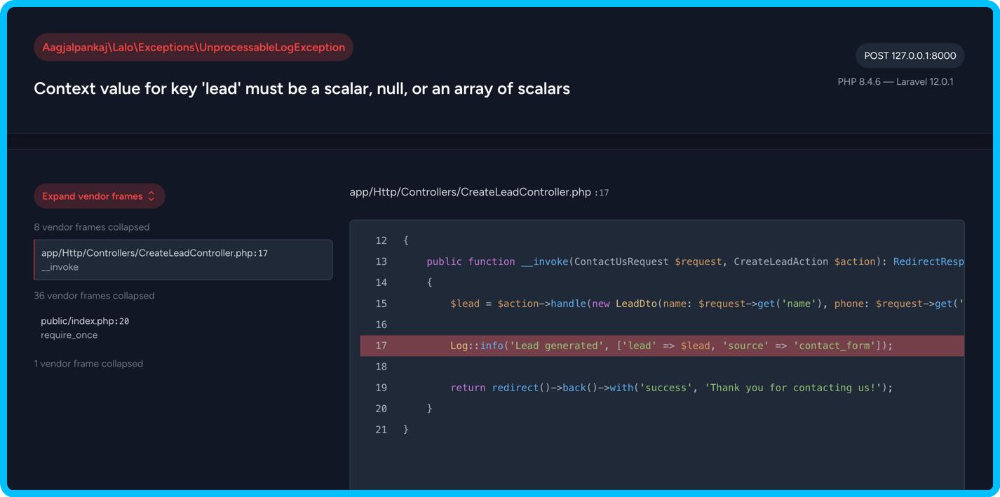

# Lalo (Laravel Logger)

  

## About

**Lalo** validates logs at runtime on non-production environments, helps making logs more concise and consistent.

It not only just validates logs but also adds additional metadata that makes log aggregation, searching, and analysis more efficient.

✨ **Monolog power:** It is built on top of [Monolog](https://github.com/Seldaek/monolog). Compatible with all monolog channels in Laravel.

✨ **No vendor-lock-in:** At any time, you can plug-in and plug-out this package easily without any refactoring.

✨ **Fully configurable:** Allows you to configure the way you want.

## Quick-start

- [Installation](./docs/100-INSTALLATION.md)
- [Usage](./docs/200-USAGE.md)
- [Logging Standards](./docs/300-LOGGING-STANDARDS.md)
